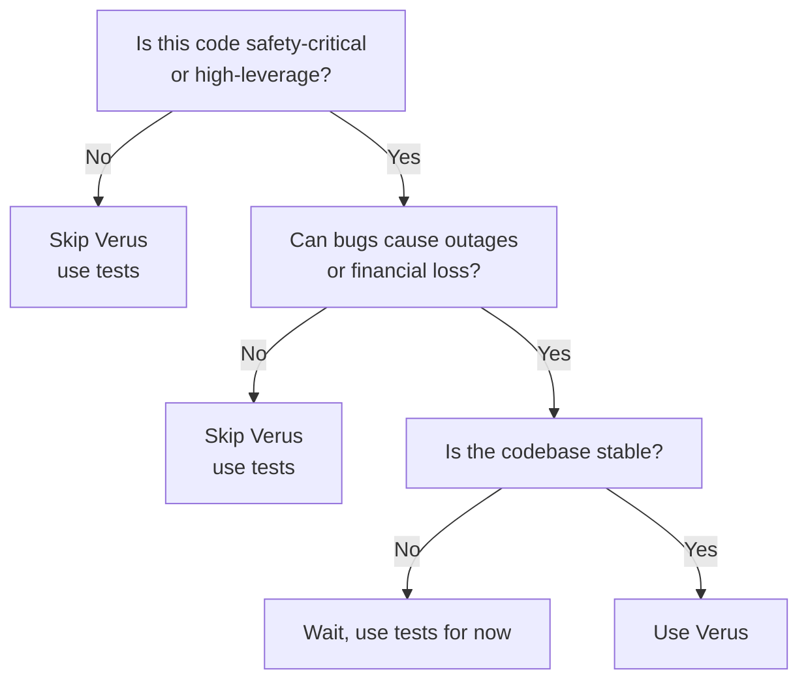

**TL;DR**: On November 18, 2025, Cloudflare had a ~3-hour global outage that traced back to a Rust panic triggered by a single `.unwrap()`. Tools like Verus can force you to prove that an `unwrap()` can’t panic *before* code ships. This post explains how Verus’s built-in specs for `Option::unwrap()` and `Result::unwrap()` work, with examples you can run today.

---

## The Bug

On November 18, 2025, Cloudflare experienced a [~3-hour global outage](https://blog.cloudflare.com/18-november-2025-outage/). The immediate cause was a panic in Rust code that looked totally reasonable in a quick review:

```rust
const MAX_FEATURES: usize = 200;

fn load_bot_features(file_path: &Path) -> Result<BotFeatures, Error> {
    // 💥 PANIC: parse_feature_file can return Err, but we unwrap anyway
    let features = parse_feature_file(file_path).unwrap();

    if features.len() > MAX_FEATURES {
        return Err(Error::TooManyFeatures);  // Never reached!
    }

    BotFeatures { features }
}
```

Here’s what went wrong, step by step:

1. Someone knew file size mattered and added a guard: `if features.len() > MAX_FEATURES`.
2. The guard ended up **after** the `unwrap()`, so it only runs if parsing already succeeded.
3. During deployment, the config file accidentally doubled in size.
4. `parse_feature_file` failed internally (returned `Err`) due to buffer limits.
5. `.unwrap()` panicked immediately; the guard below it never ran.

The tricky part is that this pattern can survive review and tests. It “has error handling,” just in the wrong place.

So what would it look like if your tooling refused to accept this code unless you proved it can’t panic?

---

## How Verus Catches This

### Unsafe Version (the bug pattern)

```rust
fn load_bot_features(file_path: &Path) -> Result<BotFeatures, Error> {
    let features = parse_feature_file(file_path).unwrap();  // 💥

    if features.len() > MAX_FEATURES {
        return Err(Error::TooManyFeatures);
    }

    Ok(BotFeatures { features })
}
```

Verus will reject it with an error like:

```
error: precondition not satisfied
  --> src/bot_manager.rs:42:52
   |
42 |     let features = parse_feature_file(file_path).unwrap();
   |                                                  ^^^^^^^^
   |
   = note: cannot prove `parse_feature_file(file_path).is_Ok()`
   = help: unwrap() requires proof that Result is Ok
```

Translation: “You didn’t show me this is `Ok`, so you don’t get to call `unwrap()`.”

### Safe Versions (two ways to fix it)

**Option 1: Propagate the error**

```rust
fn load_bot_features(file_path: &Path) -> Result<BotFeatures, Error> {
    let features = parse_feature_file(file_path)?;  // propagate

    if features.len() > MAX_FEATURES {
        return Err(Error::TooManyFeatures);
    }

    Ok(BotFeatures { features })
}
```

**Option 2: Make the safe path explicit**

```rust
fn load_bot_features(file_path: &Path) -> Result<BotFeatures, Error> {
    let result = parse_feature_file(file_path);

    if result.is_ok() {
        let features = result.unwrap();  // is_ok() → unwrap() is safe

        if features.len() > MAX_FEATURES {
            return Err(Error::TooManyFeatures);
        }

        Ok(BotFeatures { features })
    } else {
        Err(Error::ParseFailed)
    }
}
```

Once the logic is structured so the “good path” is provably good, Verus is satisfied.

But *why* does `is_ok()` make `unwrap()` provably safe? That comes directly from Verus’s built-in specifications.

---

## How Verus Works: Built-in Proofs for Unwrap Safety

[Verus](https://github.com/verus-lang/verus) is a formal verification tool for Rust developed at CMU and VMware Research. It uses SMT solvers to prove properties about your code.

The relevant idea for this post is simple: in Verus, `unwrap()` has a precondition. If you can’t prove the precondition, verification fails right where you wrote the `unwrap()`.

### `unwrap()` has a contract

**Option::unwrap() specification** ([source](https://github.com/verus-lang/verus/blob/ab8296c1b81381dd035cc4568951666b5c1d6750/source/vstd/std_specs/option.rs#L142-L147)):

```rust
impl<T> Option<T> {
    #[verifier::external_body]
    pub fn unwrap(self) -> T
        requires self.is_Some(),  // ← MUST prove this!
    {
        // ...
    }
}
```

**Result::unwrap() specification** ([source](https://github.com/verus-lang/verus/blob/main/source/vstd/std_specs/result.rs#L165-L171)):

```rust
impl<T, E> Result<T, E> {
    #[verifier::external_body]
    pub fn unwrap(self) -> T
        requires self.is_Ok(),  // ← MUST prove this!
    {
        // ...
    }
}
```

So the rule is:

- If Verus can prove `is_Some()` / `is_Ok()`, `unwrap()` is allowed.
- If it can’t, verification fails and you have to handle the case.

This is the “push the assumption into the compiler” move. It’s not magic; it’s just refusing to accept “this can’t happen” unless you make it explicit.

---

## Working Examples You Can Try Today

I put together a small repo with runnable Verus examples that show panic detection in practice:

**🔗 [formal-verification-experiments/verus](https://github.com/prasincs/formal-verification-experiments/tree/main/verus)**

### What’s included

1. **Array bounds**
   - Unsafe: `bytes[i]` without proof
   - Safe: `bytes[i]` with `requires i < bytes.len()`

2. **Division by zero**
   - Unsafe: `a / b` without proof
   - Safe: `a / b` with `requires b != 0`

3. **Integer overflow**
   - Unsafe: unchecked arithmetic
   - Safe: checked operations with bounds

4. **Option/Result unwrapping**
   - Unsafe: `.unwrap()` without proof
   - Safe: `.unwrap()` after `is_some()` / `is_ok()`

Each example shows:

- the unsafe version (Verus rejects),
- the safe version (Verus accepts),
- the exact verification error message,
- and the smallest change that makes the proof go through.

### How to run

```bash
# Install Verus
git clone https://github.com/verus-lang/verus.git
cd verus && ./tools/get-z3.sh && source ./tools/activate

# Clone examples
git clone https://github.com/prasincs/formal-verification-experiments.git
cd formal-verification-experiments/verus

# Verify examples
verus examples/panic_detection.rs

# See it catch bugs
verus examples/unsafe_unwrap.rs  # ❌ fails verification
verus examples/safe_unwrap.rs    # ✅ passes verification
```

---

## The Developer Experience: VSCode Integration

Verification used to feel “offline”: run a batch job, parse output, repeat. Verus still requires thought, but the workflow is much closer to modern static analysis.

The [Verus VSCode extension](https://verus-lang.github.io/verus/guide/getting_started_vscode.html) gives you:

1. instant verification as you type,
2. inline diagnostics (red squiggles),
3. focused messages (“cannot prove X”),
4. and often a counterexample.

Example:

```rust
fn parse_first_byte(bytes: &[u8]) -> u8 {
    bytes[0]  // ⚠️ verifier complains immediately
}
```

Hover and you’ll see something like:

```
Verification failed
Cannot prove: 0 < bytes.len()
Counterexample: bytes = []
Suggestion: Add `requires bytes.len() > 0`
```

Fix:

```rust
fn parse_first_byte(bytes: &[u8]) -> u8
    requires bytes.len() > 0
{
    bytes[0]
}
```

That feedback loop is the big win. You don’t need to wait for CI to tell you you shipped a panic.

---

## What Verus Doesn't Prove (And Why That's OK)

It helps to be clear about what you’re buying.

### Verus does NOT prove (by default)

1. **Business logic**

   ```rust
   fn calculate_discount(price: u64) -> u64
       requires price > 0
   {
       price / 2  // safe from panics; correctness is still on you
   }
   ```

2. **Performance**

   ```rust
   fn sort(arr: &mut [i32])
       ensures is_sorted(arr)
   {
       bubble_sort(arr)  // correct, but could be slow
   }
   ```

3. **Liveness (in the general case)**
   - deadlocks, livelock, starvation
   - active research area (see Anvil below)

4. **Full functional correctness**
   - you *can* prove deeper properties, but only if you write the spec you care about

### Verus is immediately useful for

- panic-freedom (bounds, unwrap, div-by-zero, overflow),
- invariants you actually write down,
- and making “should never happen” paths explicit.

Even if you stop at panic-freedom, you’ve eliminated a category of failures that tends to show up in the least-tested parts of systems: boundary cases and error paths.

---

## When Should You Use Verus?

### Use Verus when

1. **Parsing untrusted input**
   - network protocols, file formats, blockchain transactions
   - this is why I started learning Verus, via [universal-blockchain-decoder](https://github.com/prasincs/universal-blockchain-decoder/)

2. **Arithmetic on money / tokens**
   - fees, balances, settlement logic

3. **Safety-critical code**
   - kernels, embedded systems, medical devices
   - classic example: the seL4 verified kernel (verified core with a strong track record)

4. **High-blast-radius code**
   - libraries used everywhere
   - code where a single panic becomes an incident

5. **Compliance-driven environments**
   - where evidence matters as much as intent (aerospace, automotive, finance)

**Important note:** verification covers what you verify, not your entire dependency graph. Verified cores can still sit inside ecosystems that have bugs.

### Skip Verus when

1. prototyping,
2. rapid iteration (proof maintenance is real),
3. glue code / scripts,
4. low-stakes code where tests + fuzzing already give you enough confidence.

### Decision Tree



This matches the “verification guided development” style discussed in this AWS talk by Mark Hicks: start by making properties explicit (often via property-based tests), then move toward proofs once the property and interface stabilize.
[Verification Guided Development](https://youtu.be/ZuPGZ3W-ITA?list=TLGG1onXDorenzUyNTEyMjAyNQ)

---

## Comparison: Other Rust Verification Tools

Verus isn’t the only option:

| Tool | Approach | Best For | Maturity | Backed By |
|------|----------|----------|----------|-----------|
| **Verus** | SMT-based | Systems code, panic-freedom | Research → rapidly maturing | CMU, VMware |
| **Kani** | Bounded model checking | Unsafe code, bit-level | Production-ready | AWS |
| **Prusti** | Viper backend | Safe Rust, functional correctness | Research-grade | ETH Zurich |
| **Creusot** | Why3 backend | Algorithms, faster verification | Research-grade | Inria |

Quick guide:

- verifying `unsafe` code and low-level bit behavior → [Kani](https://model-checking.github.io/kani/)
- algorithmic correctness → [Creusot](https://github.com/creusot-rs/creusot) / [Prusti](https://www.pm.inf.ethz.ch/research/prusti.html)
- preventing production panics → [Verus](https://verus-lang.github.io/verus/guide/)

---

## Real-World Success Stories

### 1) OSDI 2024 Best Papers (both used Verus)

**[Anvil](https://www.usenix.org/conference/osdi24/presentation/sun-xudong)**: Verified liveness properties in Kubernetes controllers

- found bugs in real production controllers
- proved they can’t deadlock or livelock (within the stated model)

**[VeriSMo](https://www.usenix.org/conference/osdi24/presentation/zhou)**: Verified security module for confidential VMs

- found a security bug in AMD SVSM
- proved memory isolation properties

### 2) IronFleet (Microsoft Research, 2015)

Verified distributed systems (Paxos, chain replication):
Paper: [SOSP 2015](https://www.microsoft.com/en-us/research/publication/ironfleet-proving-practical-distributed-systems-correct/)

### 3) AWS and formal methods (TLA+)

From ["How Amazon Web Services Uses Formal Methods"](https://cacm.acm.org/magazines/2015/4/184701-how-amazon-web-services-uses-formal-methods/):

> "We have used TLA+ on 10 large complex real-world systems. In every case, it has found bugs."

Different tool, same lesson: if you make the model precise, you find issues that tests tend to miss.

### 4) Asterinas OS (blogged 2025)

Verified a page table implementation in a general-purpose OS using Verus:
[Asterinas Formal Verification](https://asterinas.github.io/2025/02/13/towards-practical-formal-verification-for-a-general-purpose-os-in-rust.html)

---

## The AI Connection: Why Now?

[Martin Kleppmann](https://martin.kleppmann.com/2025/12/08/ai-formal-verification.html) argued in December 2025 that AI could make formal verification go mainstream. The core idea is straightforward:

1. LLMs can help with repetitive proof scaffolding and annotations.
2. A verifier is an unforgiving checker, so “sounds plausible” doesn’t pass unless it’s actually valid.
3. Together, that can lower the activation energy.

This matches my experience so far: Claude helped me write and validate a bunch of examples for this post. It doesn’t remove the need to understand the property you’re proving, but it can speed up the grunt work.

---

## The ROI Question: Is It Worth It?

Verification has real costs:

- onboarding time,
- proof/annotation overhead,
- proof maintenance during refactors.

It tends to pay off when the code is:

- long-lived,
- high blast radius,
- and sitting in “edge-case territory” (parsers, operational limits, error paths).

### A Cloudflare-shaped back-of-the-envelope

Keeping numbers conservative:

- outage: ~3 hours
- revenue impact: on the order of ~$1.2M (based on ~$1.5B annual revenue)
- response cost: incident time + follow-up engineering work

Now compare that to the likely fix if verification forces the issue:

- Verus fails because the `unwrap()` precondition can’t be proven.
- you replace `.unwrap()` with `?` (or restructure the logic).
- you move on.

Even if the *average* proof work is bigger than this one function, the point stands: proof effort is front-loaded, while risk reduction compounds over time.

The boring framing is still the right one: verification is insurance.

---

## Criticisms and Rebuttals

### "This is cherry-picking—one outage doesn't prove anything"

That’s fair. One incident isn’t a dataset.

A commonly cited paper is ["Simple Testing Can Prevent Most Critical Failures"](https://www.usenix.org/system/files/conference/osdi14/osdi14-paper-yuan.pdf) (OSDI 2014), which analyzed 198 production failures and found a large fraction involved error handling gaps (including uncaught exceptions/panics).

If your failures look anything like that paper’s sample, then “make error paths non-optional” (which Verus effectively does around `unwrap`) attacks a meaningful slice of outages.

### "Formal verification slows down development"

Often true at the start.

But the shape is familiar:

- early on, you fight the tool,
- then you build up a library of proof patterns,
- and proofs start acting like guardrails during refactors.

If you’ve ever watched a team go from “just use `any`” to “types are non-negotiable,” it’s the same curve—applied to behavior instead of data.

### "Too immature / unproven"

I’ve believed for a long time (dating back to my first exposure to Isabelle) that the *grind* is what kept formal methods out of normal engineering workflows.

What’s changed is the combination of:

- real deployment history for verified systems,
- better tooling,
- and (increasingly) better ways to write and maintain proofs without a PhD.

That doesn’t mean “verify everything.” It means “verify the parts where the downside is ugly.”

---

## Getting Started: A Practical Path

### Phase 1: Experiment (1–2 weeks)

1. Install Verus:

   ```bash
   git clone https://github.com/verus-lang/verus.git
   cd verus && ./tools/get-z3.sh && source ./tools/activate
   ```

2. Try the examples:

   ```bash
   git clone https://github.com/prasincs/formal-verification-experiments.git
   cd formal-verification-experiments/verus
   ./run.sh examples
   ```

   I wrote the run script to build the container and run the commands so it only costs time once and doesn’t wreck your workstation.

3. Read the guide:
   - [Verus Guide](https://verus-lang.github.io/verus/)

4. Install VSCode extension:
   - [verus-analyzer](https://marketplace.visualstudio.com/items?itemName=verus-lang.verus-analyzer)
   - Heads up: I had to disable rust-analyzer to get verus-analyzer behaving.

### Phase 2: Low-hanging fruit (2–4 weeks)

Pick one small, high-value module:

- arithmetic with financial values,
- parsing untrusted input,
- array/slice indexing in hot paths,
- “this should never panic” logic.

Goal: verify one function end-to-end and make the workflow boring.

### Phase 3: Expand (ongoing)

Once you’ve verified one module:

- expand outward to helpers,
- document proof patterns that work,
- optionally integrate verification into CI for the verified areas.

### Phase 4: Cultural shift (months)

At that point the code review questions change slightly:

- “What’s the precondition here?”
- “Can we prove this indexing is safe?”
- “Where is this invariant written down?”

---

## Conclusion

Here’s the claim I actually care about:

For critical paths, “I think this can’t panic” isn’t good enough. It’s too cheap to be wrong.

What Verus gives you is a way to make panic-freedom a checked property rather than a belief. It won’t replace tests, and it won’t magically prove business logic, but it can eliminate a whole category of production surprises.

---

## Resources

### Try It Yourself
- Examples repo: [formal-verification-experiments/verus](https://github.com/prasincs/formal-verification-experiments/tree/main/verus)
- Verus tutorial: [Getting Started](https://verus-lang.github.io/verus/)
- VSCode extension: [verus-analyzer](https://marketplace.visualstudio.com/items?itemName=verus-lang.verus-analyzer)

### Papers
- [Verus: Verifying Rust Programs using Linear Ghost Types](https://github.com/verus-lang/paper-sosp24-artifact) (OOPSLA 2023, SOSP 2024)
- [Anvil: Verifying Liveness of Cluster Management Controllers](https://www.usenix.org/conference/osdi24/presentation/sun-xudong) (OSDI 2024 Best Paper)
- [VeriSMo: A Verified Security Module for Confidential VMs](https://www.usenix.org/conference/osdi24/presentation/zhou) (OSDI 2024 Best Paper)

### Incident Reports
- [Cloudflare: 18 November 2025 Outage](https://blog.cloudflare.com/18-november-2025-outage/)
- [Knight Capital: $440M Trading Loss](https://en.wikipedia.org/wiki/Knight_Capital_Group)

### Other Perspectives
- [Martin Kleppmann: AI will make formal verification mainstream](https://martin.kleppmann.com/2025/12/08/ai-formal-verification.html)
- [Simple Testing Can Prevent Most Critical Failures](https://www.usenix.org/system/files/conference/osdi14/osdi14-paper-yuan.pdf) (OSDI 2014)

---

## Acknowledgments

- CMU and VMware Research for Verus
- Cloudflare for writing clear incident reports
- Martin Kleppmann for pushing the “why now” conversation
- The Rust community for making memory safety the default

**Corrections?** Open an issue or PR on the [examples repo](https://github.com/prasincs/formal-verification-experiments). I’m still learning Verus (and its sharp edges), so I’m happy to be corrected.

---

_Published: December 2025_
_Last Updated: December 2025_
