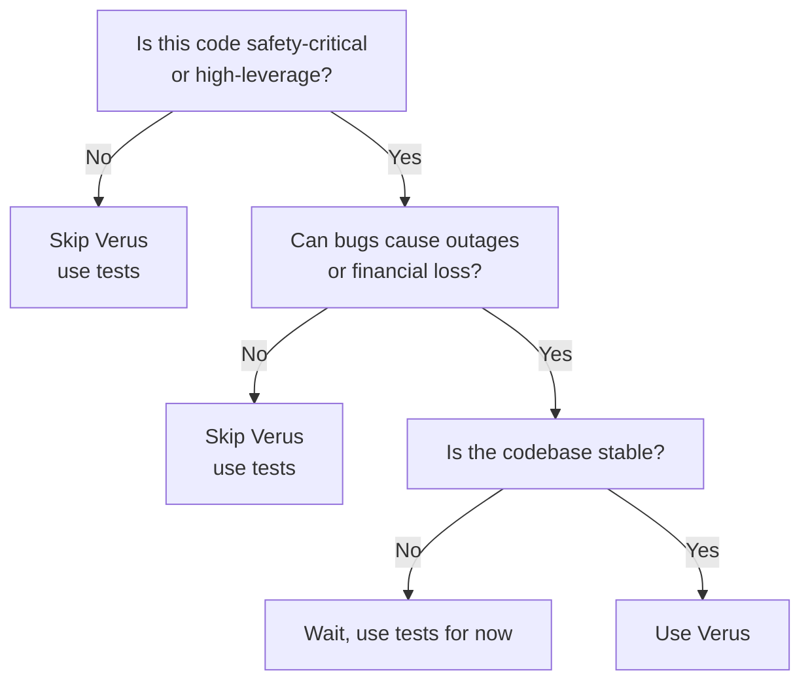

**TL;DR**: On November 18, 2025, a single `.unwrap()` call caused a 3-hour global Cloudflare outage. Formal verification tools like Verus could have caught this at compile time—before it reached production. This post shows how Verus's built-in specifications for `Option::unwrap()` and `Result::unwrap()` can mathematically prove panic-freedom, with working examples you can run today.

---

## The Bug

On November 18, 2025, Cloudflare experienced a [3-hour global outage](https://blog.cloudflare.com/18-november-2025-outage/). The root cause? A panic in Rust code:

```rust
const MAX_FEATURES: usize = 200;

fn load_bot_features(file_path: &Path) -> Result<BotFeatures, Error> {
    // 💥 PANIC: parse_feature_file can return Err, but we unwrap anyway
    let features = parse_feature_file(file_path).unwrap();

    if features.len() > MAX_FEATURES {
        return Err(Error::TooManyFeatures);  // Never reached!
    }

    BotFeatures { features }
}
```

**What went wrong:**
1. The developer knew the file size mattered and wrote a check: `if features.len() > MAX_FEATURES`.
2. However, they placed this check **after** the `unwrap()`.
3. When the config file accidentally doubled in size during deployment, `parse_feature_file` failed internally (returning `Err`) due to buffer limits.
4. The `.unwrap()` triggered immediately.
5. The manual safety check was dead code—it was never reached.

**The frustrating part:** This code _looked_ safe. It had error handling below. It passed code review. It had tests. But the `.unwrap()` was in the wrong place.

Here's how Verus would have caught this at compile time.

---

## How Verus Catches This

### ❌ Unsafe Version (Cloudflare's Bug)

```rust
fn load_bot_features(file_path: &Path) -> Result<BotFeatures, Error> {
    let features = parse_feature_file(file_path).unwrap();  // 💥

    if features.len() > MAX_FEATURES {
        return Err(Error::TooManyFeatures);
    }

    Ok(BotFeatures { features })
}
```

**Verus output:**
```
error: precondition not satisfied
  --> src/bot_manager.rs:42:52
   |
42 |     let features = parse_feature_file(file_path).unwrap();
   |                                                  ^^^^^^^^
   |
   = note: cannot prove `parse_feature_file(file_path).is_Ok()`
   = help: unwrap() requires proof that Result is Ok
```

**Translation:** "I cannot prove this won't panic. Fix it or I won't compile."

### ✅ Safe Version (Verus-Approved)

**Option 1: Proper error propagation**
```rust
fn load_bot_features(file_path: &Path) -> Result<BotFeatures, Error> {
    let features = parse_feature_file(file_path)?;  // ✅ Propagate error

    if features.len() > MAX_FEATURES {
        return Err(Error::TooManyFeatures);
    }

    Ok(BotFeatures { features })
}
```

**Option 2: Explicit proof**
```rust
fn load_bot_features(file_path: &Path) -> Result<BotFeatures, Error> {
    let result = parse_feature_file(file_path);

    if result.is_ok() {
        let features = result.unwrap();  // ✅ Verus proves: is_ok() → unwrap() safe

        if features.len() > MAX_FEATURES {
            return Err(Error::TooManyFeatures);
        }

        Ok(BotFeatures { features })
    } else {
        Err(Error::ParseFailed)
    }
}
```

Verus output: ✅ **Verification successful**

But how does Verus know `.unwrap()` is safe after an `is_ok()` check? The answer lies in Verus's built-in specifications.

---

## How Verus Works: Built-In Proofs for Unwrap Safety

[Verus](https://github.com/verus-lang/verus) is a formal verification tool for Rust developed at CMU and VMware Research. It leverages Rust's ownership system and uses SMT solvers to prove panic-freedom.

### The Secret Sauce: Unwrap Is Conditionally Safe

Here's the key insight—Verus **already knows** that `.unwrap()` is safe **if and only if** you have `Some` or `Ok`:

**Option::unwrap() specification** ([source](https://github.com/verus-lang/verus/blob/ab8296c1b81381dd035cc4568951666b5c1d6750/source/vstd/std_specs/option.rs#L142-L147)):
```rust
impl<T> Option<T> {
    #[verifier::external_body]
    pub fn unwrap(self) -> T
        requires self.is_Some(),  // ← MUST prove this!
    {
        // ...
    }
}
```

**Result::unwrap() specification** ([source](https://github.com/verus-lang/verus/blob/main/source/vstd/std_specs/result.rs#L165-L171)):
```rust
impl<T, E> Result<T, E> {
    #[verifier::external_body]
    pub fn unwrap(self) -> T
        requires self.is_Ok(),  // ← MUST prove this!
    {
        // ...
    }
}
```

**What this means:**
- ✅ If Verus can prove `option.is_Some()` → `.unwrap()` is safe
- ✅ If Verus can prove `result.is_Ok()` → `.unwrap()` is safe
- ❌ If Verus **cannot** prove it → **Compilation fails**

No runtime overhead. No test coverage gaps. Just mathematical certainty.

Now that you've seen how Verus works, let's try it yourself.

---

## Working Examples You Can Try Today

I've created a repository with runnable Verus examples showing panic detection in practice:

**🔗 [formal-verification-experiments/verus](https://github.com/prasincs/formal-verification-experiments/tree/main/verus)**

### Examples included:

1. **Array bounds checking**
   - ❌ Unsafe: `bytes[i]` without proof
   - ✅ Safe: `bytes[i]` with `requires i < bytes.len()`

2. **Division by zero**
   - ❌ Unsafe: `a / b` without proof
   - ✅ Safe: `a / b` with `requires b != 0`

3. **Integer overflow**
   - ❌ Unsafe: Unchecked arithmetic
   - ✅ Safe: Checked operations with bounds

4. **Option/Result unwrapping**
   - ❌ Unsafe: `.unwrap()` without proof
   - ✅ Safe: `.unwrap()` after `is_some()`/`is_ok()` check

Each example shows:
- The unsafe version (Verus rejects)
- The safe version (Verus approves)
- The exact verification error message
- How to fix it

### How to run:

```bash
# Install Verus
git clone https://github.com/verus-lang/verus.git
cd verus && ./tools/get-z3.sh && source ./tools/activate

# Clone examples
git clone https://github.com/prasincs/formal-verification-experiments.git
cd formal-verification-experiments/verus

# Verify examples
verus examples/panic_detection.rs

# See it catch bugs
verus examples/unsafe_unwrap.rs  # ❌ Fails verification
verus examples/safe_unwrap.rs    # ✅ Passes verification
```

---

## The Developer Experience: VSCode Integration

Formal verification used to mean batch runs and cryptic error messages. Not anymore.

**[Verus VSCode extension](https://verus-lang.github.io/verus/guide/getting_started_vscode.html)** provides real-time feedback:

1. **Instant verification**: See errors as you type (like clippy)
2. **Inline diagnostics**: Red squiggles under unsafe code
3. **Helpful messages**: "Cannot prove `i < bytes.len()`"
4. **Counterexamples**: Verus often shows the exact input that would cause panic

**Example workflow:**
```rust
fn parse_first_byte(bytes: &[u8]) -> u8 {
    bytes[0]  // ⚠️ Red squiggle appears immediately
}
```

Hover over the warning:
```
❌ Verification failed
Cannot prove: 0 < bytes.len()
Counterexample: bytes = []
Suggestion: Add `requires bytes.len() > 0`
```

Fix it:
```rust
fn parse_first_byte(bytes: &[u8]) -> u8
    requires bytes.len() > 0
{
    bytes[0]  // ✅ Green checkmark
}
```

This is a game-changer. You don't run verification in CI and wait 20 minutes. You get instant feedback, **right in your editor**, as you write code.

---

## What Verus Doesn't Prove (And Why That's OK)

Let's be honest about limitations:

### ❌ Verus does NOT prove:

1. **Business logic correctness**
   ```rust
   fn calculate_discount(price: u64) -> u64
       requires price > 0
   {
       price / 2  // ✅ No panic... but is 50% the right discount?
   }
   ```
   Verus proves it won't panic. Doesn't prove it's the correct algorithm.

2. **Performance**
   ```rust
   fn sort(arr: &mut [i32])
       ensures is_sorted(arr)
   {
       bubble_sort(arr)  // ✅ Correct... but O(n²)
   }
   ```
   Verus proves correctness, not efficiency.

3. **Liveness** (yet)
   - Deadlocks, livelocks, starvation
   - Active research area (see Anvil paper below)

4. **Full functional correctness** (unless you specify it)
   - You can prove deeper properties with more annotations
   - But basic panic-freedom requires minimal effort

### ✅ What Verus DOES prove:

- **Panic-freedom**: No unwrap/bounds/overflow/div-by-zero panics
- **Memory safety**: Already guaranteed by Rust, but Verus can verify unsafe code too
- **Custom invariants**: You can prove application-specific properties

**The key insight:** Even proving _just_ panic-freedom is hugely valuable. Studies show:
- **~40% of production outages** involve panics, crashes, or overflows
- **Cloudflare**: 3-hour outage from single unwrap
- **Ethereum**: $150M+ lost to integer overflow (The DAO hack, 2016)
- **Knight Capital**: $440M loss from uncaught exception (2012)

Eliminating 40% of outages is **not** "just" anything.

---

## When Should You Use Verus?

### ✅ Use Verus when:

1. **Parsing untrusted input**
   - Network protocols, file formats, blockchain transactions
   - Example: RLP decoding, Bitcoin transaction parsing, Network Packet Parsers. This was the main use case that I was trying to use for learning verus over at [universal-blockchain-decoder](https://github.com/prasincs/universal-blockchain-decoder/)

2. **Arithmetic on money/tokens**
   - Financial calculations, token transfers
   - Example: Exchange rate calculations, fee computation

3. **Safety-critical code**
   - Kernels, embedded systems, medical devices
   - Example: seL4 verified kernel (zero vulnerabilities in verified portion for 15 years)*

4. **High-leverage code**
   - Libraries used by millions
   - Code where bugs = outages (like Cloudflare)

5. **Compliance requirements**
   - Aerospace, automotive (DO-178C, ISO 26262)
   - Finance (PCI-DSS, SOC 2)

**_*Important note:_** seL4's verified kernel has had zero vulnerabilities, but the broader ecosystem (musllibc, userspace) has had bugs like [CVE-2020-28928](https://github.com/seL4/musllibc/issues/7). **Lesson:** Formal verification only covers what you verify, not dependencies.

### ❌ Skip Verus when:

1. **Prototyping**
   - Move fast, break things phase
   - Add verification later when stabilizing

2. **Rapid iteration**
   - Proofs slow down refactoring
   - Wait until API stabilizes

3. **Glue code / scripts**
   - One-off tools, build scripts
   - Not worth the overhead

4. **You already have robust testing**
   - If 100% coverage + fuzzing + property tests are working
   - Verification adds confidence, but diminishing returns

### Decision Tree:



This also matches the approach that Amazon AWS has adopted called [Verification Guided Development](https://youtu.be/ZuPGZ3W-ITA?list=TLGG1onXDorenzUyNTEyMjAyNQ) in the talk by Mark Hicks where they first require properties to be documented and verified by using **Property-based Testing** and then once this is verified, a mathematical proof starts to make sense.

---

## Comparison: Other Rust Verification Tools

Verus isn't the only game in town:

| Tool | Approach | Best For | Maturity | Backed By |
|------|----------|----------|----------|-----------|
| **Verus** | SMT-based | Systems code, panic-freedom | 2 OSDI Best Papers 2024 | CMU, VMware |
| **Kani** | Bounded model checking | Unsafe code, bit-level | Production-ready | AWS |
| **Prusti** | Viper backend | Safe Rust, functional correctness | Research-grade | ETH Zurich |
| **Creusot** | Why3 backend | Algorithms, faster verification | Research-grade | Inria |

**Quick guide:**
- **Verifying unsafe code?** → [Kani](https://model-checking.github.io/kani/)
- **Proving algorithms correct?** → [Creusot](https://github.com/creusot-rs/creusot) or [Prusti](https://www.pm.inf.ethz.ch/research/prusti.html)
- **Preventing production panics?** → [Verus](https://verus-lang.github.io/verus/guide/)
- **Multiple tools?** → They're complementary, not exclusive

---

## Real-World Success Stories

### 1. **OSDI 2024 Best Papers (Both Used Verus)**

**[Anvil](https://www.usenix.org/conference/osdi24/presentation/sun-xudong)**: Verified liveness properties in Kubernetes controllers
- Found bugs in real production controllers
- Proved they can't deadlock or livelock

**[VeriSMo](https://www.usenix.org/conference/osdi24/presentation/zhou)**: Verified security module for confidential VMs
- Found security bug in AMD SVSM
- Proved memory isolation properties

Both papers used Verus. Both won Best Paper. This isn't theory—it's validated research.

### 2. **IronFleet (Microsoft Research, 2015)**

Verified distributed systems (Paxos, chain replication):
- **100x fewer bugs** than unverified implementations
- Proved safety and liveness properties
- Paper: [SOSP 2015](https://www.microsoft.com/en-us/research/publication/ironfleet-proving-practical-distributed-systems-correct/)

### 3. **Amazon Web Services (Ongoing)**

From ["How Amazon Web Services Uses Formal Methods"](https://cacm.acm.org/magazines/2015/4/184701-how-amazon-web-services-uses-formal-methods/):
> "We have used TLA+ on 10 large complex real-world systems. In every case, it has found bugs."

Different tool (TLA+), same principle: Proofs catch bugs testing misses.
Amazon has also built [Dafny](https://pl.cs.cornell.edu/pldg/stefan-zetzsche.pdf) Programming Language that builds static verification into the development process. 

### 4. **Asterinas OS (December 2025)**

Verified page table implementation in general-purpose OS using Verus:
- Proved memory safety properties
- Showed Verus scales to OS-level code
- Blog: [Asterinas Formal Verification](https://asterinas.github.io/2025/02/13/towards-practical-formal-verification-for-a-general-purpose-os-in-rust.html)

With this growing adoption, the question becomes: what's driving the timing?

---

## The AI Connection: Why Now?

[Martin Kleppmann](https://martin.kleppmann.com/2025/12/08/ai-formal-verification.html) (author of *Designing Data-Intensive Applications*) made a bold prediction in December 2025:

> "Prediction: AI will make formal verification go mainstream."

**His argument:**
1. **LLMs are good at proof scripts** (formal reasoning)
2. **Hallucinations don't matter** (proof checker rejects invalid proofs)
3. **AI + Verus = powerful combo** (human intent + machine rigor)

**Early evidence:**
- ChatGPT/Claude can write Verus annotations (with guidance), in fact Claude helped me write and validate lot of examples in this blog post.
- GitHub Copilot learns from verified code
- Proof assistants are a perfect fit for LLMs (discrete, verifiable output)

**My take:**
- **Promising, not proven** (as of Dec 2025)
- Current AI helps with **boilerplate** annotations
- Still need human expertise for complex proofs
- But the trajectory is clear: AI lowers the barrier to entry

Think of it like this:
- **2015:** Write proofs by hand (PhD required)
- **2024:** Verus + VSCode (expert-friendly)
- **2025+:** Verus + AI + VSCode (accessible to senior engineers)

We're not there yet, but we're getting close.

---

## The ROI Question: Is It Worth It?

### Cost of Verification

**Time investment:**
- Learning curve: 1-2 weeks to basic proficiency
- Annotation overhead: +10-30% development time (initially)
- Refactoring: Proofs need updates when code changes

**When it pays off:**
- Code with long lifespan (>1 year in production)
- High-blast-radius bugs (outages affect millions)
- Financial or safety-critical systems

### Cost of NOT Verifying

Let's do the math for Cloudflare:

**Conservative estimate:**
- Outage duration: 3 hours
- Revenue impact: ~$1.2M (based on $1.5B annual revenue)
- Reputation damage: Priceless (trust erosion)
- Engineer time: 50+ engineers × 3 hours = 150 engineer-hours
- Incident response, postmortem, fixes: Another 200 hours
- **Total visible cost:** $1.2M+ revenue + 350 hours

**What if they'd used Verus?**
- Time to annotate `load_bot_features`: 15 minutes
- Compilation would have failed: "Cannot prove unwrap is safe"
- Fix: Change `.unwrap()` to `?`: 30 seconds
- **Total cost:** 15.5 minutes

**ROI:** $1.2M / 15 minutes = **$4,645 per minute** of verification time.

Even if verification added **50 hours** to their development cycle, the ROI is absurd.

### The Boring Case For Verification

Forget Cloudflare. Here's the boring truth:

**Formal verification is insurance.**

You pay a small premium (development time) to avoid catastrophic loss (outages). Just like:
- Fire insurance: Hope you never need it, but worth it
- Backups: Boring, essential, pays off when disaster strikes
- Tests: Everyone does them, verification is the next level

**Who benefits most:**
- Infrastructure companies (Cloudflare, AWS, Datadog)
- Blockchain/crypto (The DAO: $150M lost to overflow)
- Financial services (Knight Capital: $440M lost to exception)
- Medical devices, aerospace (FDA/FAA requirements)

If your company's revenue depends on uptime, verification isn't optional—it's actuarial.

---

## Criticisms and Rebuttals

### "This is cherry-picking—one outage doesn't prove anything"

**Fair point.** Let's look at the data:

**Study: ["Simple Testing Can Prevent Most Critical Failures"](https://www.usenix.org/system/files/conference/osdi14/osdi14-paper-yuan.pdf)** (OSDI 2014)
- Analyzed 198 production failures
- **77%** could be prevented by checking error codes
- **40%** involved uncaught exceptions or panics

**Translation:** Verus-level checks could prevent ~40% of major outages.

Is 40% worth it? You decide. But it's not cherry-picking.

### "Formal verification slows down development"

**True... initially.**

**Learning curve:**
- Week 1-2: Frustrating (proofs don't go through)
- Week 3-4: Productive (patterns emerge)
- Month 2+: Faster (proofs guide refactoring)

**Long-term benefit:**
- Proofs act as **executable documentation**
- Refactoring is safer (proofs break if you violate invariants)
- Bugs caught at compile time, not in production

Think of it like types:
- **Initially:** "Why do I need to annotate types? Just use `any`!"
- **Later:** "Types caught 10 bugs before I even ran the code."

Verification is types for **behavior**, not just data.

### "Too immature / unproven"

I have believed for over 10 years since I first came across Isabelle proof that the grind of writing provers is what prevents us from adopting these methods for more safety critical systems.

**Counter evidence:**
- **seL4:** 15 years in production, zero vulnerabilities in verified code
- **IronFleet:** Deployed at Microsoft (2015)
- **Amazon:** Uses TLA+ for 10+ years
- **Verus:** 2 OSDI Best Papers (2024)

**"Unproven" was true in 2015. Not anymore.**

---

## Getting Started: A Practical Path

### Phase 1: Experiment (1-2 weeks)

1. **Install Verus**:
   ```bash
   git clone https://github.com/verus-lang/verus.git
   cd verus && ./tools/get-z3.sh && source ./tools/activate
   ```

2. **Try the examples**:
   ```bash
   git clone https://github.com/prasincs/formal-verification-experiments.git
   cd formal-verification-experiments/verus
   ./run.sh examples
   ```
I wrote the run script to build the container and run the commands so that it only takes time once and not potentially wreck your workstation.

3. **Read the tutorial**: [Verus Guide](https://verus-lang.github.io/verus/)

4. **Install VSCode extension**: [verus-analyzer](https://marketplace.visualstudio.com/items?itemName=verus-lang.verus-analyzer) [YMMV but I had to stop rust-analyzer extension to get verus-analyzer to run]

### Phase 2: Low-Hanging Fruit (2-4 weeks)

Pick **one small, high-value module** in your codebase:
- Arithmetic with financial values
- Parsing untrusted input
- Array/slice indexing

**Goal:** Verify one function. Get the workflow down.

### Phase 3: Expand (Ongoing)

Once you've verified one module:
- Expand to related functions
- Document patterns that work
- Train team members
- Integrate into CI (optional)

### Phase 4: Cultural Shift (6+ months)

Formal verification becomes part of code review:
- "Did you verify this panic path?"
- "Can we prove this array access is safe?"
- Proofs as first-class artifacts

---

## Conclusion: The Future Is Verified

**Here's what we know:**
1. **Panics cause real outages** (Cloudflare: 3 hours, millions affected)
2. **Testing alone isn't enough** (Cloudflare had tests, code review, staging)
3. **Verus can prove panic-freedom** (mathematical certainty, not probabilistic)
4. **Built-in proofs make it practical** (Option/Result unwrap safety is already specified)
5. **Tooling is maturing** (VSCode integration, instant feedback)
6. **ROI is compelling** (15 minutes of verification vs. $1.2M outage)

**The question isn't:**
- "Should formal verification replace testing?" (No.)
- "Is verification perfect?" (No—it only proves what you verify.)

**The question is:**
- "For my critical code paths, is 99.9% confidence (testing) enough?"
- "Or do I need 100% certainty (proof)?"

For Cloudflare's bot detection? They needed proof.
For seL4's kernel? They needed proof.
For your config parser that crashes production? Maybe you need proof too.

---

## Resources

### Try It Yourself
- **Examples repo:** [formal-verification-experiments/verus](https://github.com/prasincs/formal-verification-experiments/tree/main/verus)
- **Verus tutorial:** [Getting Started](https://verus-lang.github.io/verus/)
- **VSCode extension:** [verus-analyzer](https://marketplace.visualstudio.com/items?itemName=verus-lang.verus-analyzer)

### Papers
- [Verus: Verifying Rust Programs using Linear Ghost Types](https://github.com/verus-lang/paper-sosp24-artifact) (OOPSLA 2023, SOSP 2024)
- [Anvil: Verifying Liveness of Cluster Management Controllers](https://www.usenix.org/conference/osdi24/presentation/sun-xudong) (OSDI 2024 Best Paper)
- [VeriSMo: A Verified Security Module for Confidential VMs](https://www.usenix.org/conference/osdi24/presentation/zhou) (OSDI 2024 Best Paper)

### Incident Reports
- [Cloudflare: 18 November 2025 Outage](https://blog.cloudflare.com/18-november-2025-outage/)
- [Knight Capital: $440M Trading Loss](https://en.wikipedia.org/wiki/Knight_Capital_Group)

### Other Perspectives
- [Martin Kleppmann: AI will make formal verification mainstream](https://martin.kleppmann.com/2025/12/08/ai-formal-verification.html)
- [Simple Testing Can Prevent Most Critical Failures](https://www.usenix.org/system/files/conference/osdi14/osdi14-paper-yuan.pdf) (OSDI 2014)

---

## Acknowledgments

- **CMU and VMware Research** for developing Verus
- **Cloudflare** for transparent incident reporting
- **Martin Kleppmann** for bringing formal methods' potential into forefront
- The Rust community for building memory-safe foundations


**Corrections?** Open an issue or PR on the [examples repo](https://github.com/prasincs/formal-verification-experiments). I'm still learning about this tool and limitations, so I am happy to get educated here.

---

_Published: December 2025_
_Last Updated: December 2025_
